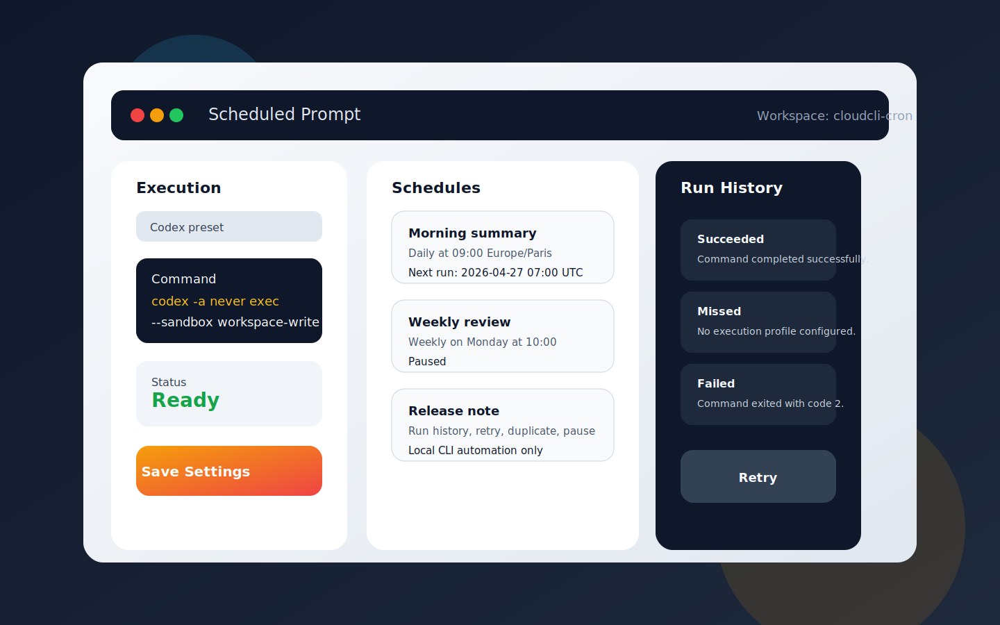

# Scheduled Prompt

CloudCLI / ClaudeCodeUI plugin to create workspace-scoped scheduled prompts and execute them through a local CLI such as Codex, Claude Code, or Gemini CLI.

## Preview



## What It Does

- Create one-time schedules
- Create recurring schedules:
  - daily
  - selected weekdays
  - weekly
  - monthly
- Persist schedules and run history per workspace
- Configure a local execution command per workspace
- Run a schedule immediately with `Run Now`
- Retry failed or missed runs
- Track `running`, `succeeded`, `failed`, and `missed` runs

## Current Scope

This is the first functional local-only version.

- No hosted CloudCLI dependency
- No direct integration with the host chat session
- Scheduled executions launch a fresh local CLI process
- Notifications and cross-workspace orchestration are out of scope

## Global Dashboard

The `v0.2.0` feature branch adds a dedicated global dashboard tab for cross-workspace visibility.

- aggregated job inventory across known workspaces
- direct per-job actions from the global view:
  - `Run Now`
  - `Pause`
  - `Resume`
  - `Retry`
- degraded workspace warnings
- workspace drilldown back to the original workspace context
- partial-data signaling when one or more ledgers cannot be read cleanly

## Requirements

- Node.js 18+
- A CloudCLI-compatible host with plugin support
- At least one supported local CLI installed and authenticated if required:
  - `codex`
  - `claude`
  - `gemini`

## Installation

### From GitHub in CloudCLI

1. Open `Settings > Plugins`
2. Install this repository URL
3. Enable `Scheduled Prompt`

### Manual Local Install

Clone or copy the repository into your local plugin directory, then build it:

```bash
git clone https://github.com/grostim/cloudcli-cron.git \
  ~/.claude-code-ui/plugins/cloudcli-plugin-workspace-scheduled-prompts
cd ~/.claude-code-ui/plugins/cloudcli-plugin-workspace-scheduled-prompts
npm install
npm run build
```

Then restart CloudCLI / ClaudeCodeUI.

## Development

```bash
npm install
npm run build
npm test
```

## How To Use

### 1. Open A Workspace

The plugin is workspace-scoped. Schedules and execution settings are attached to the currently selected workspace path.

### 2. Configure Execution

In the `Execution` panel:

1. Choose a preset or enter a custom command
2. Save execution settings
3. Confirm the status changes to `Ready`

Available presets:

- `Codex`
  - command: `codex`
  - prompt transport: `stdin`
- `Claude Code`
  - command: `claude`
  - prompt transport: `{{prompt}}` argument template
- `Gemini CLI`
  - command: `gemini`
  - prompt transport: `{{prompt}}` argument template

### 3. Create A Schedule

1. Enter a name
2. Enter the prompt to run
3. Choose the schedule type
4. Fill the timing fields
5. Check the preview and next run
6. Save the schedule

When a save succeeds:

- the plugin shows a success banner
- the updated schedule is highlighted in the list

### 4. Run Or Recover

From the schedule list:

- `Run Now` launches the configured local command immediately
- `Pause` disables automatic execution
- `Resume` re-enables automatic execution
- `Duplicate` creates a copy
- `Delete` removes the schedule

From run history:

- `Retry` re-executes a failed or missed run immediately

## Prompt Delivery Model

The plugin launches the configured command inside the workspace directory.

Runtime behavior:

- if the command or args contain `{{prompt}}`, the prompt is expanded inline
- otherwise the prompt is written to `stdin`

Environment variables exposed to the child process:

- `SCHEDULED_PROMPT`
- `SCHEDULED_WORKSPACE_PATH`
- `SCHEDULED_TASK_NAME`
- `SCHEDULED_TASK_ID`
- `SCHEDULED_FOR`

Supported argument templates:

- `{{prompt}}`
- `{{workspacePath}}`
- `{{taskName}}`
- `{{taskId}}`
- `{{scheduledFor}}`

## Execution Timing

- Automatic runs are attempted only for occurrences that are still within the scheduler grace window.
- If the plugin or host was unavailable long enough for an occurrence to become stale, that occurrence is recorded as `missed`.
- Recurring schedules record each missed slot in history, then continue from the next future occurrence without catch-up replay.

## Storage

Workspace ledgers are stored locally under:

```text
~/.cloudcli-workspace-scheduled-prompts/
```

Each workspace gets a separate JSON ledger containing:

- schedules
- run history
- execution profile

## Skills And Codex

Scheduled `Codex` runs execute a fresh `codex exec` process. They do not inherit the current interactive Codex session.

That means:

- available workspace skills are not implicitly "active"
- if you depend on a skill, mention it explicitly in the prompt

Recommended pattern:

```text
Use skill speckit-plan from .agents/skills/speckit-plan/SKILL.md.
Then generate the implementation plan for the current workspace.
```

## Troubleshooting

### Status Stays `Needs Config`

No execution profile is saved yet for the current workspace.

Fix:

1. Open the `Execution` panel
2. Choose a preset or configure a command manually
3. Save settings

### A Run Is Marked `missed`

The schedule became due but automatic execution could not start.

Typical causes:

- no execution profile saved
- invalid command
- CLI not installed
- host was not running when the schedule became due

Use `Retry` after fixing the configuration.

### A Run Is `failed`

The command started but exited non-zero, timed out, or failed to launch.

Check the run history entry for:

- exit code
- stderr summary
- timeout message

### Codex Preset Previously Failed With `--ask-for-approval`

Older saved Codex profiles used an invalid argument layout.

The plugin now auto-normalizes the legacy Codex preset on reload.

## Known Limits

- No cron syntax
- No external notification channel
- No built-in command validation button yet
- No direct reuse of the live host chat session
- CLI-specific auth and policy prompts must already be handled by the target CLI setup

## Related Docs

- [quickstart.md](/home/sorg/CloudCLI/cloudcli-cron/specs/001-workspace-scheduled-prompts/quickstart.md)
- [plan.md](/home/sorg/CloudCLI/cloudcli-cron/specs/001-workspace-scheduled-prompts/plan.md)
